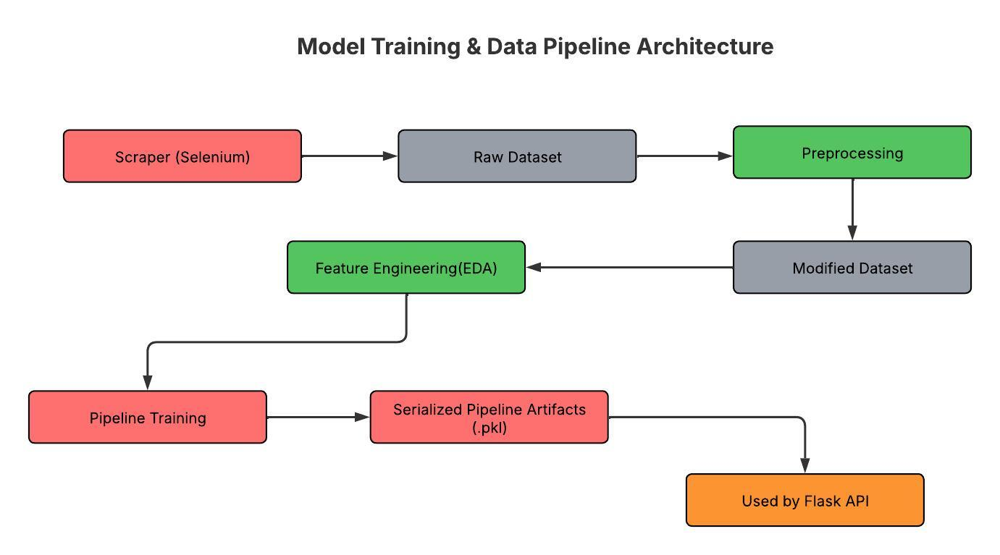

# 🏠 Swedish Property Price Predictor
**An End-to-End Machine Learning Pipeline: From Selenium-based Extraction to Gradient Boosting (GBM) Modeling.**

A production-ready Machine Learning system that scrapes, processes, and predicts Swedish housing prices. This project moves beyond static datasets to handle real-world, messy web data with a focus on reproducibility and deployment.

---

**[🚀 Live App Link: Deployed on AWS EC2](http://13.48.105.186/)**

## Description
This project automates the entire ML lifecycle for Swedish real estate data. It features a custom Selenium-based scraper to collect data directly from the source, a robust Scikit-Learn preprocessing pipeline to handle data cleaning, and a Flask-based inference API. The system includes a Bootstrap-fronted web application for user predictions and a monitoring dashboard to track model performance.

### 🛠️ Tech Stack
* **Data Acquisition:** Selenium (WebDriver), Python
* **Data Science:** Scikit-Learn, Pandas, NumPy, Matplotlib
* **Modeling:** Gradient Boosting (GBM), Linear Regression, SVM, Random Forest
* **Visualization:** Matplotlib, Seaborn
* **Backend:** Flask
* **Frontend:** Bootstrap (Inference & Monitoring Dashboard)
* **Infrastructure:** AWS EC2

---

### 🚀 The ML Lifecycle

1.  **Data Acquisition:** Developed an automated **Selenium-based pipeline** to aggregate real-time property listings from Swedish real-estate platforms, effectively bypassing the lack of public APIs.
2.  **Feature Engineering:**  Implemented **Target Encoding** for high-cardinality location data and handled **skewed price distributions**.
    * Engineered logic for handling missing values and outlier detection for specific Swedish property metrics (e.g., *boarea*, *biarea*, *tomtarea*).
3.  **Exploratory Data Analysis (EDA):** Identified key price drivers and regional trends using statistical distributions, correlation heatmaps, and geospatial insights.
4.  **Model Training:** Optimized an **Gradient Boosting Regressor** to handle the non-linear relationships inherent in financial and geographical data, ensuring high-fidelity valuation predictions.
5.  **Deployment:** Architecting a scalable **AWS-based inference API** and **Full Stack Web application** including a monitoring dashboard for production style monitoring post deployment.

---
## System Architecture & Pipeline
The following diagrams illustrate how data flows from raw HTML to a production prediction.

### Model Training & Data Pipeline

### Inference & System Architecture

---

## Repository Structure
* `Script/`: Selenium scripts for Hemnet data collection and cleaning.
* `notebooks/`: Exploratory Data Analysis (EDA), feature selection logic, and model benchmarking.
* `model/`: Core logic for pipeline construction and training, including the final serialized `.pkl` artifacts.
* `templates/`: Bootstrap HTML files for the web app and dashboard.
* `static/`: Bootstrap JavaScript, CSS, and  and images for the web app.
* `app.py`: Flask inference and monitoring API.
* `model_logs.csv`: Log file to save the model prediction for monitoring dashboard.
* `requirements.txt`: Python librariesrequired to run the project.

---

## Credits
This project was inspired by and built upon the foundations of an open-source Swedish property price project. I extended the original work by:
* Redesigning the System Architecture & inference pipeline layer for real-time API use.
* Developed a Bootstrap Web application for inference and monitoring.
* Building the full deployment workflow on AWS EC2.

---

### 🤝 Connect
Feedback and contributions are welcome!
* **LinkedIn:** [Priyansh Gupta](https://www.linkedin.com/in/pggupta/)

---

### 📄 License
This project is licensed under the [MIT License](https://opensource.org/license/mit).
